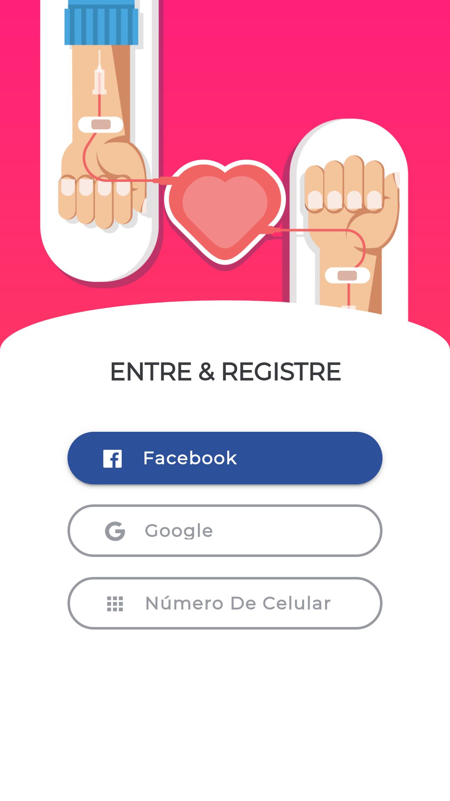
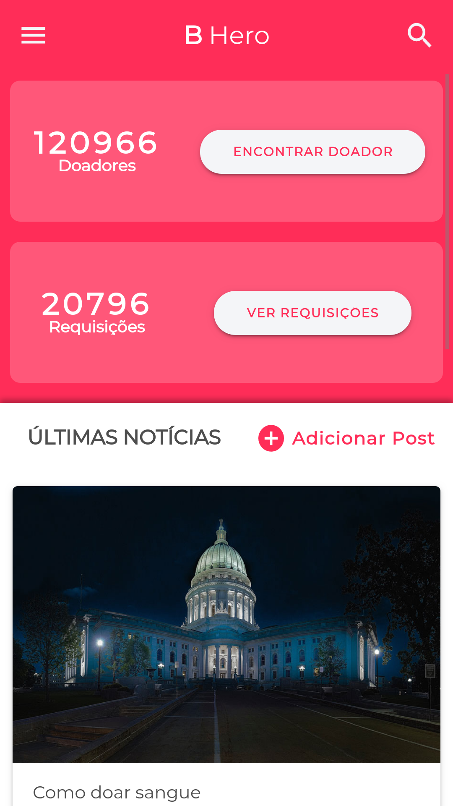
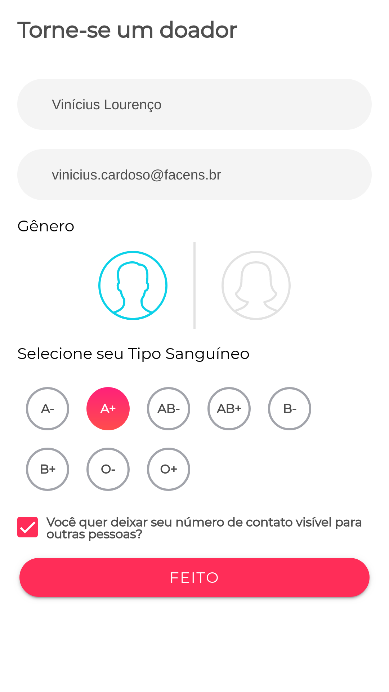
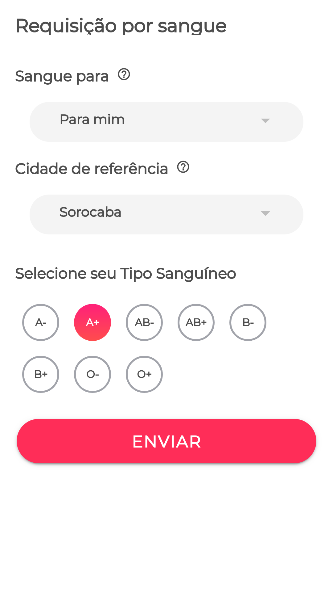

# B Hero
Esse é um aplicativo com intuito de divulgar e ajudar pessoas que procuram doar sangue ou que precisam buscar por sangue.

## Intuito
O aplicativo está sendo feito para ser entregue como um projeto da matéria de Empreendedorismo. Todo o código é publico e sintam-se livre para usar se quiserem.

## Membros
As pessoas que participaram desse projeto são:

- Vinícius Lourenço
- Vinícius Bonatti
- Vinícius Ibanez
- Vitor Lara
- Vitor Santos

## Créditos
O design do aplicativo foi criado por Jitu Raut, como sendo um design livre para uso.
Você pode encontrar o design original [nesse link](https://www.behance.net/gallery/69827321/B-Hero-Blood-donation-app-free-UI-kit).

## Imagens do Aplicativo
A seguir, as imagens de como está atualmente o aplicativo.

#### A página de login

---
#### A página de início

---
#### A página para se tornar um doador

---
#### A página para requisitar sangue

